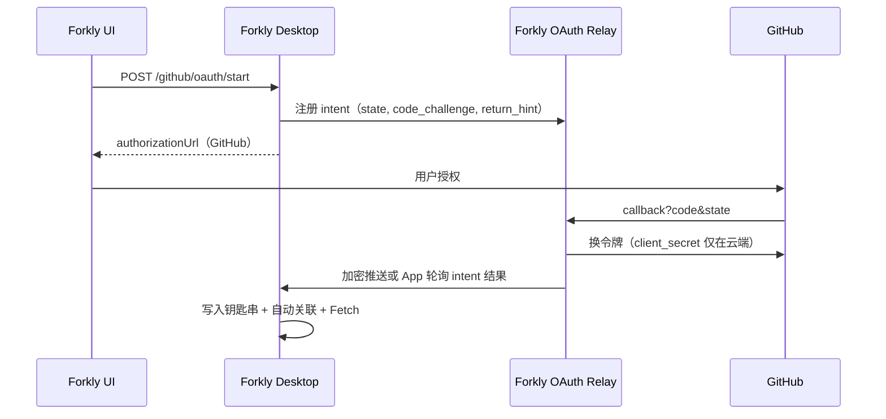

# GitHub OAuth 云端中转（后续工作）

## 背景

当前 Forkly 桌面版在二进制中嵌入 `FORKLY_GITHUB_CLIENT_SECRET`，在本地 loopback 完成 Authorization Code 换令牌。该模式可快速交付「无感连接」，但 **Secret 无法对终端用户保密**。

目标：将换令牌迁移到 Forkly 可控的云端中转，桌面端仅持有 public client + PKCE，不再打包 Secret。

## 目标架构

## API 合同（草案）

| 端点 | 说明 |
|------|------|
| `POST /v1/oauth/github/intents` | 桌面注册 `state`、`code_challenge`、`project_id`、`return_to` |
| `GET /v1/oauth/github/intents/{id}` | 桌面轮询完成状态（或 WebSocket/SSE） |
| `GET /v1/oauth/github/callback` | GitHub 固定回调到云端域名 |

响应字段：`status`（pending/complete/error）、`account`（login、account_id 元数据）、`encrypted_token_bundle`（可选，仅桌面可解密）。

## 威胁模型

- **移除**：桌面内嵌 Secret 被逆向提取的风险。
- **保留**：loopback / CSRF / 一次性 state；用户本机会话劫持仍需防范。
- **新增**：云端中转可用性、云端 Secret 泄露、intent 重放——需 mTLS 或设备绑定密钥、intent 短 TTL、单次消费。

## 迁移步骤

1. 部署云端 OAuth Relay，注册 GitHub OAuth App 回调到云端 URL。
2. 桌面 `WebOAuthConfigured()` 改为检测 Relay 可达 + Client ID，而非本地 Secret。
3. 双轨期：优先 Relay，失败降级本地换令牌（可配置开关）。
4. Release 校验改为 `oauthRelayConfigured=true`。
5. 移除 `FORKLY_GITHUB_CLIENT_SECRET` 构建变量与文档中的桌面 Secret 说明。

## 回滚

- Feature flag 切回本地 loopback 换令牌（保留旧 OAuth App 回调）。
- 云端仅保存 intent 元数据，不长期存 refresh_token；回滚后用户重新授权即可。

## 验收

- 官方 Release 产物不含 Client Secret 字符串。
- `go test` / `make verify-oauth` 针对 Relay 合同有集成测试。
- 授权 → 关联 → Fetch 体验与当前桌面 loopback 一致。
