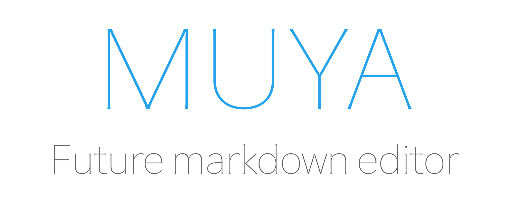

<p align="center"></p>

<p align="center"><b>Muya</b> — a standalone Markdown editor for the web, extracted from <a href="https://github.com/marktext/marktext">MarkText</a>.</p>

> Status: Muya is still under active development. APIs may change between minor versions and it is not yet recommended for production use.

## Features

- **CommonMark + GFM** blocks: paragraphs, ATX/Setext headings, bullet/ordered/task lists, code fences, tables, block quotes, horizontal rules, raw HTML, images. Parser baseline tracked against CommonMark 0.31 and GFM 0.29-gfm (see `packages/core/test/spec/conformance.md`).
- **Inline formats** with a floating toolbar, plus optional super/subscript, footnotes, front matter, and inline math.
- **Footnotes** end-to-end: `[^id]` references and `[^id]: …` definitions render with an interactive footnote tool and backref anchors on export.
- **Reference links and images**: `[text][ref]` / `![alt][ref]` resolve from `[ref]: url "title"` definitions on both render and round-trip.
- **Code block line numbers** — opt in with `codeBlockLineNumbers: true` to render gutters alongside fenced/indented code (and previewable blocks).
- **Diagrams & rich content**: [KaTeX](https://katex.org/) math, [Mermaid](https://mermaid.js.org/), [Vega/Vega-Lite](https://vega.github.io/), [PlantUML](https://plantuml.com/), and [Prism](https://prismjs.com/) syntax highlighting in code blocks.
- **Markdown ↔ HTML** round-trip via [`marked`](https://github.com/markedjs/marked) (read path) and [`turndown`](https://github.com/mixmark-io/turndown) + `joplin-turndown-plugin-gfm` (write path). `MarkdownToHtml` is exposed as a standalone utility; output passes through [DOMPurify](https://github.com/cure53/DOMPurify) (`sanitizeHyperlink` + `isValidAttribute`) for XSS-safe rendering.
- **Search and replace** with regex support, plus undo/redo history.
- **i18n** out of the box: 9 locales ship with the package — English, Simplified and Traditional Chinese, Japanese, Korean, Spanish, French, German, Portuguese.
- **JSON state model** built on [`ot-json1`](https://github.com/ottypes/json1) / [`ot-text-unicode`](https://github.com/ottypes/text-unicode) — wire it up to your own transport for collaborative editing.
- **TypeScript first** — types ship in the package, no extra `@types/*` install needed.

## Installation

```sh
npm install @muyajs/core
# or
pnpm add @muyajs/core
```

Muya is a browser library and expects a bundler (Vite, webpack, Rollup, esbuild, …). The package ships ESM (`lib/es`), CJS (`lib/cjs`), UMD (`lib/umd`), and full TypeScript declarations (`lib/types`).

## Quick start

```ts
import {
    CodeBlockLanguageSelector,
    EmojiSelector,
    FootnoteTool,
    ImageEditTool,
    ImageResizeBar,
    ImageToolBar,
    InlineFormatToolbar,
    LinkTools,
    Muya,
    ParagraphFrontButton,
    ParagraphFrontMenu,
    ParagraphQuickInsertMenu,
    PreviewToolBar,
    TableColumnToolbar,
    TableDragBar,
    TableRowColumMenu,
    zhCN,
} from '@muyajs/core';

import '@muyajs/core/lib/style.css';

// 1. Register the UI plugins you need (once, globally on the class).
Muya.use(EmojiSelector);
Muya.use(FootnoteTool);
Muya.use(InlineFormatToolbar);
Muya.use(ImageToolBar);
Muya.use(ImageResizeBar);
Muya.use(ImageEditTool, {
    imagePathPicker: async () => '/path/to/image.png',
    imageAction: async () => 'https://example.com/uploaded.png',
});
Muya.use(CodeBlockLanguageSelector);
Muya.use(LinkTools, {
    jumpClick: (linkInfo) => {
        const href = linkInfo?.href;
        if (href && /^https?:\/\//.test(href))
            window.open(href, '_blank', 'noopener,noreferrer');
    },
});
Muya.use(ParagraphFrontButton);
Muya.use(ParagraphFrontMenu);
Muya.use(ParagraphQuickInsertMenu);
Muya.use(TableColumnToolbar);
Muya.use(TableDragBar);
Muya.use(TableRowColumMenu);
Muya.use(PreviewToolBar);

// 2. Create the editor against an existing DOM node.
const container = document.querySelector('#editor') as HTMLElement;
const muya = new Muya(container, {
    markdown: '# Hello, Muya',
    footnote: true,
    codeBlockLineNumbers: true,
});

// 3. Optional: switch the UI language before init.
muya.locale(zhCN);

// 4. Boot. Nothing renders until init() runs.
muya.init();
```

A complete example, including a Vite project setup, lives under [`examples/`](./examples).

## API at a glance

The `Muya` instance returned from `new Muya(el, options)` exposes:

| Method | Purpose |
| --- | --- |
| `init()` | Mount the editor and instantiate registered UI plugins. |
| `locale(localeObject)` | Switch the UI locale. Use one of the bundled exports (`en`, `zhCN`, `zhTW`, `ja`, `ko`, `es`, `fr`, `de`, `pt`) or supply your own. |
| `getMarkdown()` | Serialize the current document to Markdown. |
| `getState()` | Return the underlying JSON state (the source of truth). |
| `setContent(content, autoFocus?)` | Replace the document with Markdown (`string`) or `TState[]`. |
| `undo()` / `redo()` | Step through the history stack. |
| `search(value, opts?)` | Run a search; `opts` includes `{ isRegexp, isCaseSensitive, isWholeWord, selectHighlight }`. |
| `find('previous' \| 'next')` | Move the active match. |
| `replace(value, { isSingle, isRegexp })` | Replace the active match or all matches. |
| `selectAll()` | Select the entire document. |
| `getTOC()` | Snapshot the current heading outline as `Array<{ level, text, slug }>`. |
| `on(event, fn)` / `off(event, fn)` / `once(event, fn)` | Subscribe to editor events. |
| `destroy()` | Tear down the editor and free DOM listeners. |

Standalone utilities exported from the package root:

| Export | Purpose |
| --- | --- |
| `MarkdownToHtml` | Server-safe Markdown → HTML class (`new MarkdownToHtml(md).generate()`). |
| `renderToStaticHTML(stateOrMarkdown, opts?)` | One-shot static HTML renderer; pass `{ sanitize: false }` only for trusted input (parser conformance tests use this). |

Useful events emitted on the editor:

| Event | Payload |
| --- | --- |
| `json-change` | OT operations describing the latest document mutation. The full state can be read back via `muya.getState()` or serialized to Markdown via `muya.getMarkdown()`. |
| `selection-change` | New selection (`{ anchor, focus, path }`). |
| `focus` / `blur` | Fired when the contenteditable surface gains or loses focus. |

The full set of constructor options (font size, list defaults, math/footnote toggles, front matter delimiters, Mermaid/Vega themes, etc.) is described by `IMuyaOptions` in [`packages/core/src/types.ts`](./packages/core/src/types.ts); defaults live in `MUYA_DEFAULT_OPTIONS` in [`packages/core/src/config/index.ts`](./packages/core/src/config/index.ts).

## Bundled UI plugins

Plugins are floating tools/menus that you opt into with `Muya.use(Plugin, options?)`. They live under `packages/core/src/ui/` and are exported from the package root:

| Plugin | What it does |
| --- | --- |
| `InlineFormatToolbar` | Bold / italic / link / etc. toolbar that follows the selection. |
| `EmojiSelector` | `:` trigger emoji picker. |
| `CodeBlockLanguageSelector` | Language picker inside fenced code blocks. |
| `ImageToolBar`, `ImageResizeBar`, `ImageEditTool` | Image-related affordances; `ImageEditTool` accepts `imagePathPicker` and `imageAction` callbacks for upload flows. |
| `LinkTools` | Hover toolbar over native `<a>`, markdown links, and reference links. Takes a `jumpClick` callback to control jump-out behavior. |
| `FootnoteTool` | Floating popover for editing footnote definitions; requires the `footnote: true` editor option. |
| `ParagraphFrontButton`, `ParagraphFrontMenu` | The handle and menu that appear to the left of the active block. |
| `ParagraphQuickInsertMenu` | The `/` slash-command menu for inserting blocks. |
| `TableColumnToolbar`, `TableDragBar`, `TableRowColumMenu` | Table editing affordances. |
| `PreviewToolBar` | Tools shown over previewable blocks (math, Mermaid, etc.). |

`examples/src/main.ts` is the canonical reference for which plugins to register for a fully-featured editor.

## Architecture

```
Muya
├── EventCenter        custom pub/sub for editor-internal + user events
├── Editor             owns runtime modules and routes DOM events
│   ├── JSONState      ot-json1 document, source of truth
│   ├── InlineRenderer custom lexer + snabbdom virtual DOM
│   ├── Selection      live selection bridged to the JSON path
│   ├── Search         regex search + highlight overlay
│   ├── Clipboard      paste/copy bridging via turndown / marked
│   ├── History        OT-aware undo/redo stack
│   └── ScrollPage     root block of the tree
├── Ui                 registry of floating tools/menus (toolbars, pickers)
└── I18n               locale dispatcher
```

The block tree under `ScrollPage` is built from `TreeNode → Parent → (Content | Format)`. Each concrete block lives in `packages/core/src/block/{commonMark,gfm,extra,content}/` and is registered in `src/block/index.ts::registerBlocks()`. Markdown serialization is handled in `src/state/{markdownToState,stateToMarkdown,markdownToHtml,htmlToMarkdown}.ts`.

Inline edits are encoded as `ot-text-unicode` operations nested inside `ot-json1` operations, so the entire document, including inline runs, is OT-ready — connect your own transport and you have collaborative editing.

For a deeper, file-level walkthrough see [`CLAUDE.md`](./CLAUDE.md).

## Project structure

This is a [pnpm](https://pnpm.io/) + [Turborepo](https://turborepo.com/) monorepo:

```
.
├── packages/
│   ├── core/         @muyajs/core — the published editor library
│   ├── facade/       README-only stub (no source yet)
│   └── findReplace/  README-only stub (no source yet)
├── examples/         muya-examples — Vite vanilla-TS demo, consumes core via workspace:*
├── docs/             logo, roadmap, JSON state reference
├── CLAUDE.md         agent-oriented architecture and conventions guide
└── CHANGELOG.md      generated by release-it (angular conventional-changelog preset)
```

Engines: Node ≥18 for consumers, **Node ≥20.19, ≥22.13, or ≥24 for cutting releases** (the changelog plugin pins `^20.19.0 || ^22.13.0 || >=24.0.0`), pnpm ≥8.5 (pinned to `pnpm@10.22.0`). Build target is `chrome70`.

## Development

```sh
pnpm install
pnpm dev           # boots the examples Vite dev server (turbo dev:demo)
```

Useful local commands (Turbo fans these out across packages):

| Command | What it runs |
| --- | --- |
| `pnpm build` | `tsc && vite build` in `packages/core` — emits `lib/{es,umd,cjs,types}`. |
| `pnpm test` / `pnpm coverage` | Vitest, with `--passWithNoTests`. |
| `pnpm lint` / `pnpm lint:fix` | ESLint (antfu config) over `packages/`. |
| `pnpm lint:types` | `tsc --noEmit` per package. |
| `pnpm lint:css` | Stylelint over all CSS. |
| `pnpm check-circular` | `madge --circular` against the public entry — CI enforces this. |

Commit messages must follow [Conventional Commits](https://www.conventionalcommits.org/) (`build, ci, chore, docs, feat, fix, perf, refactor, revert, style, test`); husky and commitlint enforce this. Pre-commit, lint-staged auto-fixes ESLint and Stylelint findings on touched files.

## Build

```sh
pnpm build
```

Vite produces three formats (`lib/es/index.js`, `lib/umd/index.js`, `lib/cjs/index.js`) and `vite-plugin-dts` emits declarations to `lib/types/`. The `publishConfig.exports` map in `packages/core/package.json` is what npm consumers see after publish; the dev-time `exports` map points at `src/index.ts` so workspace consumers like `examples/` can import the TypeScript source directly.

## Publishing

Releases of `@muyajs/core` are driven by [release-it](https://github.com/release-it/release-it) with `@release-it-plugins/workspaces` and `@release-it/conventional-changelog` (angular preset). From a clean `master` on Node ≥20.19 / ≥22.13 / ≥24 (matching the changelog plugin's `^20.19.0 || ^22.13.0 || >=24.0.0` engines pin — older 20.x / early 22.x will fail at preset load), with `npm whoami` showing an account that has write access to the `@muyajs` scope:

```sh
# 1. Quality gates (also runs in CI)
pnpm lint
pnpm lint:types
pnpm test
pnpm check-circular

# 2. Clean rebuild (lib/ is gitignored; never publish a stale build)
rm -rf packages/core/lib
pnpm build

# 3. Cut the release (bumps versions, writes CHANGELOG, commits/tags/pushes, publishes to npm)
pnpm release <version>     # e.g. 0.1.0
```

`pnpm release` will prompt for an npm 2FA one-time password by opening a browser auth flow during the `pnpm publish` step. If publishing breaks mid-flight (network/OTP/timeout) after the git tag is already pushed, retry just the upload — the version is already bumped:

```sh
pnpm --filter @muyajs/core publish --tag latest --access public --no-git-checks
```

GitHub releases are created separately with the `gh` CLI (release-it's GitHub integration is disabled in `.release-it.json` to avoid needing a `GITHUB_TOKEN` env var):

```sh
VERSION=0.1.0
awk -v v="$VERSION" '$0 ~ "^# \\["v"\\]"{flag=1; next} /^## \[/{flag=0} flag' \
    CHANGELOG.md > /tmp/release-notes.md
gh release create "v$VERSION" --title "v$VERSION" --notes-file /tmp/release-notes.md
```

## Recent updates

**v0.2.0 (in flight)** — the marktext-muya backport batch. 22 PRs (#208–#230) ported the upstream marktext muya tree onto `@muyajs/core` end-to-end:

- New surface: footnote block + tool, reference links/images, `LinkTools`, `getTOC()` public API, `focus` / `blur` events, code block line numbers, image small-image + inline resize-bar suppression.
- Parser conformance: CommonMark 0.31 and GFM 0.29-gfm fixture runners (`pnpm --filter @muyajs/core test:spec`) with a locked baseline (87.7% / 86.3%) and a regression gate via `expected-failures.json`.
- Hardening: XSS protections (hyperlink + Mermaid + code-block + langInput input via DOMPurify), normalizeTable crash fix, loadImageAsync failure cache, `stateToMarkdown` serialization baseline, clipboard/paste/copy corrections, editor cursor / IME / autopair / table navigation fixes, EventCenter listener-leak + once-iteration fix.
- Tests: 1 → 386 unit tests (43 files).

See [`CHANGELOG.md`](./CHANGELOG.md) for the full per-PR list.

## Roadmap

See [`docs/ROADMAP.md`](./docs/ROADMAP.md) for the long-running roadmap (TypeScript migration, browser-compatibility goals, docs site, CI/CD, tests). Short-term release notes live in [`CHANGELOG.md`](./CHANGELOG.md).

## FAQ

**What is the relationship between MarkText and Muya?**

Muya is derived from MarkText. The team's goal is for Muya to live outside the desktop app so it can power web editors as well; the Electron-specific assumptions have been progressively peeled away.

**Does the Muya version track MarkText's version?**

No, the two version numbers are independent.

## Built with Muya

- [MarkText](https://github.com/marktext/marktext) — next-generation Markdown editor for macOS, Windows, and Linux.
- [MindBox](https://www.mindbox.cc/) — note-taking app with first-class Markdown support.

## License

[MIT](./LICENSE) © [Jocs](https://github.com/Jocs)
